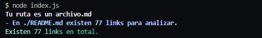
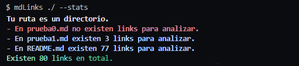
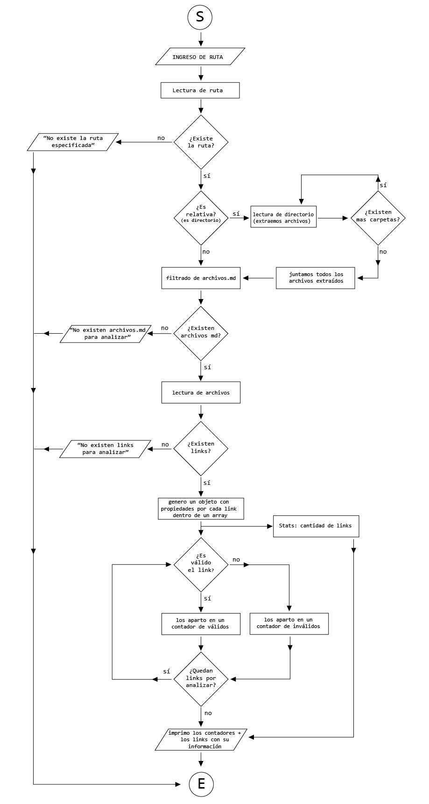
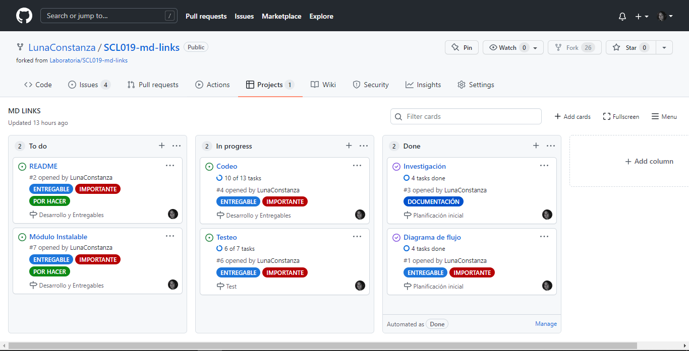

# Validator Markdown Links

## Índice
* [1. Descripción](#1-descripción)
* [2. Instrucciones](#2-instrucciones)
* [3. Ejemplos](#3-ejemplos)
* [4. Diagrama de flujo](#4-diagrama-de-flujo)
* [5. Planificación](#5-planificación)
***

## 1. Descripción
Módulo instalable para validar links de archivos Markdown a través de la librería o por comando, que indica la cantidad de links encontrados, y propiedades tales como su href, el status, si esta "ok/fail" y el arvhivo (file) en el que se encuentra, dependiendo de la opción que se elija. 

## 2. Instrucciones

### 2.1 Instalación:

```
npm i lunaconstanza-mdlinks
```

### 2.2 Utilización:

Esta herramienta consta de dos parámetros, una ruta(path) y una opción(options); la ruta puede ser un _archivo_ o un _directorio_ ('./archivo.md' ó './src') y las opciones pueden ser _--stats_, _--validate_ o vacío.

_--stats_ indica la cantidad total de links encontrados.

_--validate_ indica el href, status, ok, y el file donde se encontro el link.

_undefined_ indica el href y el file donde se encontro el link.  

#### por Librería:
```
const {mdLinks} = require('lunaconstanza-mdlinks');

mdLinks('path', 'options')
```
Para ver los resultados debe correr el archivo con node por terminal.

#### por terminal (CLI - Interfaz de Línea de Comando):
```
$ mdLinks path options
```

## 3. Ejemplos
por Librería
```
const {mdLinks} = require('lunaconstanza-mdlinks');
mdLinks('.README.md', '--stats')
```


por Terminal


## 4. Diagrama de flujo


## 5. Planificación

Se utilizo [_Projects_](https://github.com/LunaConstanza/SCL019-md-links/projects/1) de GitHub para tener una organización más fluída.
